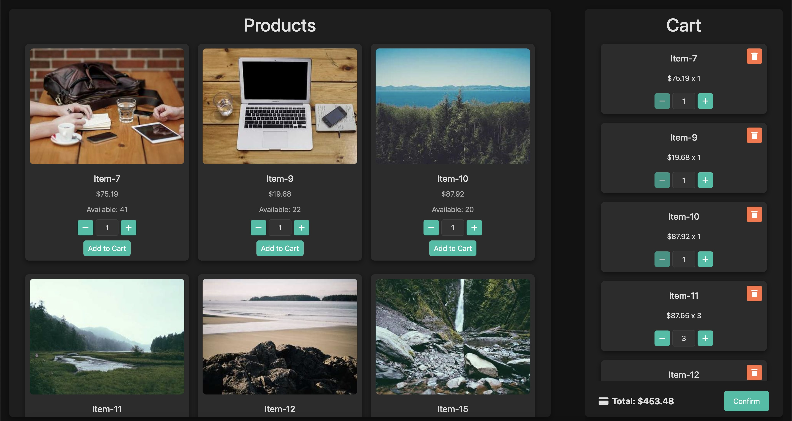
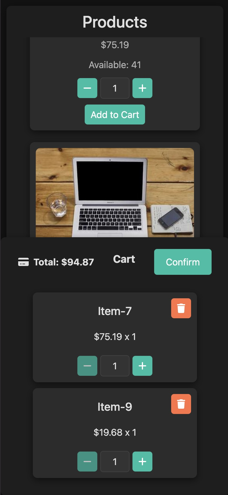
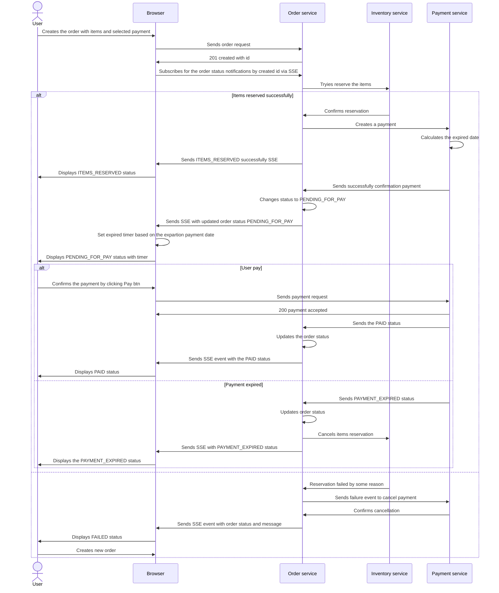
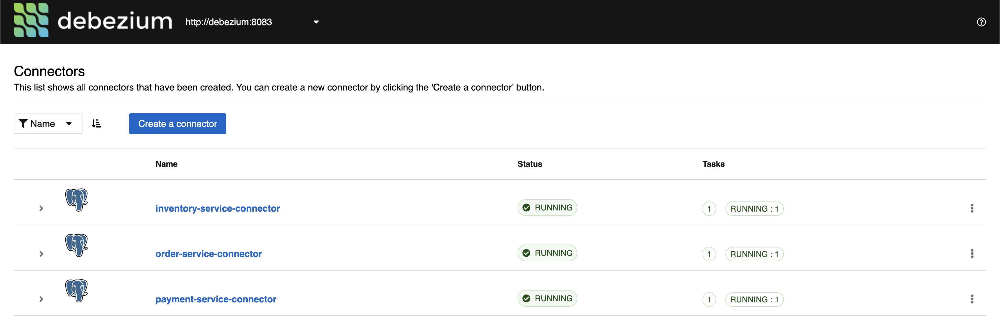
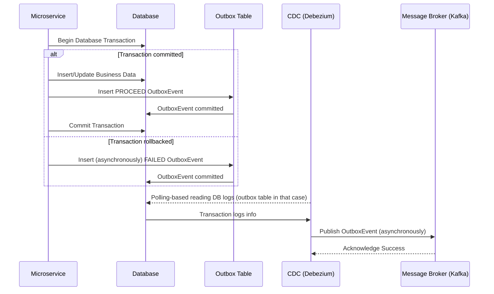

# DEMO Distributed E-commerce System with Event-Driven Architecture
This project is a **distributed e-commerce system** implemented using an **event-driven architecture**, featuring multiple services collaborating seamlessly to handle orders, payments, and inventory management. It is designed to demonstrate concepts such as microservices, event sourcing, change data capture (CDC), and scalability using tools like Kafka, PostgreSQL, Debezium, and more.




## Key Features
1. **Microservice Architecture**:
    - Each service is independent and manages its own domain-specific logic and database.
    - Services include:
        - **Order Service**: Handles order creation and management.
        - **Payment Service**: Processes payments and handles payment state tracking.
        - **Inventory Service**: Manages product inventory and updates availability.

2. **Event-Driven Communication**:
    - Services communicate asynchronously via **Apache Kafka** topics.
    - The **Outbox pattern** is implemented to ensure reliable publishing of events.

3. **Change Data Capture (CDC)**:
    - Uses **Debezium** to monitor and react to changes in the database tables of each service.
    - Debezium captures database changes and publishes them as Kafka events.

4. **PostgreSQL Backends**:
    - Each microservice has an independent PostgreSQL database for data persistence.
    - Dockerized databases with custom configurations, initialization scripts, and health checks.

5. **Web Frontend**:
    - A **ReactJS** frontend provides a user-friendly interface to interact with the system.
    - The frontend integrates APIs from different microservices to manage products, orders, and payments.

6. **Infrastructure and Configuration with Docker Compose**:
    - Fully containerized application using Docker Compose.
    - Services include Kafka, Kafka UI, Debezium, PostgreSQL databases, and the microservices themselves.

7. **Debezium UI**:
    - A web UI for monitoring Debezium Connectors and managing CDC configurations.

8. **Kafka UI**:
    - A web UI for inspecting Kafka topics and the state of messages in the system.

## Project Structure
- `order-service/`: Microservice to handle orders.
- `payment-service/`: Microservice to handle payments.
- `inventory-service/`: Microservice to handle inventory management.
- `webapp/`: React-based frontend for the e-commerce system.
- `debezium-connectors/`: Pre-configured Debezium connector definitions for each service.
- **Infrastructure**:
    - **Kafka** for message brokering.
    - **Debezium** for database change data capture.
    - **PostgreSQL** databases for service persistence.

## Project Description
Order Processing Flow with Reservation and Payment Handling

This sequence diagram describes the process of order creation, item reservation, and payment handling, along with potential failure scenarios.

---

1. **Order Creation**
   1.	The User initiates the order by selecting items and a payment method.
   2.	The Browser sends the order request to the Order Service.
   3.	The Order Service responds with a 201 Created status and provides an order ID.
   4.	The Browser subscribes to order status updates via Server-Sent Events (SSE).

2. **Item Reservation**
   1. The Order Service attempts to reserve the items by calling the Inventory Service.
   2. If the reservation is successful:
         *	The Inventory Service confirms the reservation.
         *	The Order Service creates a payment request in the Payment Service.
         *	The Payment Service calculates the payment expiration date.
         *	The Order Service updates the status to ITEMS_RESERVED and sends an SSE event.
         *	The Browser updates the UI to display ITEMS_RESERVED status.

3. **Payment Handling**
   1. The Payment Service confirms the payment is ready and updates the Order Service.
   2. The Order Service changes the status to PENDING_FOR_PAY and sends an SSE update.
   3. The Browser sets a timer based on the payment expiration date and displays the countdown.

4. **Payment Scenarios**

   a) **User Completes Payment**
      1. The User clicks the Pay button.
      2. The Browser sends the payment request to the Payment Service.
      3. The Payment Service processes the request and returns 200 Payment Accepted.
      4. The Payment Service updates the Order Service with PAID status.
      5. The Order Service updates the status and sends an SSE event.
      6. The Browser updates the UI to show PAID status.

   b) **Payment Expires**
      1. If the User does not pay within the time limit, the Payment Service sends a PAYMENT_EXPIRED event.
      2. The Order Service:
            *	Updates the order status.
            *	Cancels the inventory reservation.
            *	Sends an SSE event with PAYMENT_EXPIRED status.
      3. The Browser updates the UI to show PAYMENT_EXPIRED.

**Key Takeaways**
*	SSE (Server-Sent Events) is used to keep the UI updated with order status changes.
*	The Inventory Service ensures item availability before proceeding with payment.
*	The Payment Service sets an expiration time to handle unpaid orders gracefully.
*	Failure handling mechanisms ensure order rollback in case of reservation or payment issues.

## Running the Project
To set up and run the project locally:
1. Install **Docker** and **Docker Compose** on your system.
2. Clone the repository.
3. Start the application stack using Docker Compose (it will take about 3-5 minutes):
``` bash
   docker-compose up
```

---

If you don't see the connectors in the Debezium UI, you need restart the service **debezium-connector**



---

Access the following components:
 - **Frontend**: [http://localhost](http://localhost)
 - **Kafka Topics UI**: [http://localhost:8092](http://localhost:8092)
 - **Debezium UI**: [http://localhost:8089](http://localhost:8089)
 - **Services**:
   - Order Service: [http://localhost:8086](http://localhost:8086)
   - Payment Service: [http://localhost:8085](http://localhost:8085)
   - Inventory Service: [http://localhost:8084](http://localhost:8084)
 - **Databases**:
   - Order Service: [jdbc:postgresql://localhost:5433/inventory_service_db](jdbc:postgresql://localhost:5433/inventory_service_db)
   - Payment Service: [jdbc:postgresql://localhost:5434/inventory_service_db](jdbc:postgresql://localhost:5434/inventory_service_db)
   - Inventory Service: [jdbc:postgresql://localhost:5435/inventory_service_db](jdbc:postgresql://localhost:5435/inventory_service_db)

## Postman Collection

To explore and test the APIs, use the Postman collection. You can either download it directly or import it using the "Run in Postman" button below.

- [Download Postman Collection](https://github.com/Metelyoff/micro-ecommerce/blob/main/Micro%20E-commerce.postman_collection.json)

[](https://god.gw.postman.com/run-collection/24504602-96dafe1f-3aae-4d9f-8901-df77df17cf2e?action=collection%2Ffork&source=rip_markdown&collection-url=entityId%3D24504602-96dafe1f-3aae-4d9f-8901-df77df17cf2e%26entityType%3Dcollection%26workspaceId%3D77be33e6-4bcf-4494-a300-c4a8816ee6d2)

## Technologies Used
- **Backend**: Java, Spring Boot, Spring Data JPA
- **Frontend**: React, Bootstrap
- **SSE**: Server side events to notify frontend
- **Messaging**: Apache Kafka
- **Database**: PostgreSQL
- **CDC**: Debezium
- **Containerization**: Docker Compose
- **Monitoring**: Kafka UI, Debezium UI

### **Principles of Using the `OutboxTransactionAspect`**
The `OutboxTransactionAspect` is a design pattern implementation and supporting utility commonly used in an **event-driven architecture**. Its purpose is to ensure reliable messaging between microservices by leveraging the **Outbox Pattern** for publishing events to a message broker (like Kafka or RabbitMQ) in a way that ensures atomicity and eventual consistency. Here's a detailed explanation for your README:
### **Why is the `OutboxTransactionAspect` Needed?**
In distributed system architectures, services communicate asynchronously using events. However:
1. **Reliability Issues**: When a service updates its database and publishes an event to a message broker, it’s possible that one operation succeeds while the other fails (e.g., database updated but event not published, or vice versa), resulting in inconsistent state or lost updates.
2. **Atomicity Guarantee**: Traditional methods don’t guarantee that updating the database and publishing the event occur as a single atomic unit of work.
3. **Outbox Solution**: The **OutboxTransactionAspect** ensures that:
   - Events are written to the **Outbox table** in the same transaction as the database update.
   - Events are reliably published to the message broker asynchronously **after the transaction is committed**.

### **How Does the `@OutboxTransaction` Work?**
The `@OutboxTransaction` works by intercepting transactional methods using AOP (Aspect-Oriented Programming). It ensures events are written to a dedicated **Outbox table** as part of the business logic's database transaction. The process typically has the following steps:
1. **Database Update with Outbox**:
   - As part of a database transaction (e.g., creating an order, updating inventory), an **OutboxEvent** is created and inserted into an `outbox` table along with the main data changes.

2. **Transaction Commit**:
   - The transactional database operation ensures that either both the state change and Outbox write succeed, or none of them are performed (ensuring atomicity).

3. **Event Publishing**:
   - A background process (e.g., a scheduler, message relay service, or Kafka Connect) asynchronously reads and publishes the events from the `outbox` table to the message broker (Kafka, for instance).
   - Once the message is successfully published, the Outbox entry is marked as published (often a `status` column is updated or the row is deleted).

This separation ensures that the system achieves **eventual consistency**, even in the presence of intermittent failures.
### **OutboxEvent Fields**
The `OutboxEvent` is the entity saved in the `outbox` table. Its fields typically include metadata about the event and the payload.

| **Field**            | **Description**                                                                  |
|----------------------|----------------------------------------------------------------------------------|
| `id`                 | A unique identifier for the event.                                               |
| `contextId`          | The ID of the entity (e.g., Order ID) related to the event.                      |
| `processName`        | Automatically sets to indicate which class and method triggered the transaction. |
| `eventName`          | Defines the type of the event (e.g., `OrderCreated`, `PaymentProcessed`).        |
| `status`             | The local transaction status PROCESSED or FAILED.                                |
| `statusMessage`      | The readable success or failure message of the transaction work.                 |
| `payload`            | The serialized payload/data of the event (usually JSON).                         |
| `processedTimestamp` | Transaction processing timestamp (how long is it).                               |
| `createdAt`          | Timestamp indicating when the event was created in the `outbox` table.           |
| `version`            | For an optimist locking.                                                         |

The sequence below illustrates how the `@OutboxTransaction` orchestrates database operations and ensures reliable event processing:


### **Advantages of Using `OutboxTransaction`**
1. **Atomicity**: Ensures that business logic operations and event recording are a single atomic unit of work.
2. **Idempotence**: As events are recorded in the database, failed publishing attempts can be retried without risking duplicate state changes.
3. **Resilience**: Increases fault tolerance by decoupling message publication from business operations.

### **When to Use the OutboxTransaction?**
- Use it when your microservices rely on asynchronous communication with guaranteed event delivery for critical data consistency (e.g., an order service notifying inventory and payment services of a placed order).
- It’s particularly valuable in systems using **change data capture (CDC)** tools like **Debezium**, as the `Outbox` table can be monitored to publish events in real time.

## **How to handle CDC events**

The `OutboxEventHandler` is a key component designed to process specific outbox events in the system. It enables a clean and modular way to handle various types of events generated by the application's services. Here's an explanation of its usage:

---

### **What is `OutboxEventHandler`?**

The `OutboxEventHandler` interface or implementation (depending on your setup) is responsible for handling events stored in the **Outbox** table. These events are typically part of the **Outbox pattern**, where database state changes (like inserts/updates/deletes) are captured as events and later processed for asynchronous communication (e.g., publishing to Kafka).
Each `OutboxEventHandler` implementation focuses on handling specific types of events and their associated status (e.g., `PROCESSED`, `FAILED`). This ensures that event-handling logic is encapsulated per event type and status, allowing for better scalability.

---

### **How the System Uses `OutboxEventHandler`**
The **`OutboxEventHandlerFactory`** class facilitates the resolution and retrieval of an appropriate handler for a given event. It does this by maintaining a map between event-specific keys (combining event name and status) and handler instances. This factory approach decouples the handler lookup logic from the actual event-processing logic.

1. **Event Handling Process**:
   - Events are captured in the outbox (e.g., through database operations).
   - The appropriate `OutboxEventHandler` is retrieved from the `OutboxEventHandlerFactory` based on the event type and status.
   - The resolved handler processes the event accordingly (e.g., publishes the event to Kafka, marks it as processed, etc.).

2. **Key Generation**:
   - The `OutboxEventHandlerFactory` resolves a unique key for each event by combining the `eventName` and `status`.
   - This key is used to map and retrieve the corresponding handler from the factory’s internal map.

   Example Key:
   ```
   order-created.SUCCESS
   ```
3. **Dynamic Handler Registration**:
   - The system uses `OutboxEventHandlerFactory`'s constructor to automatically register all available `OutboxEventHandler` beans.
   - This means that when you develop a new handler for a specific event-type/status, its inclusion is seamless as long as it is annotated as a Spring component (e.g., `@Component`).
---

### **Usage for Clients**

As a client (i.e., a service or component in the architecture that wants to process events), you simply need to:

1. **Capture the Event**:
   - Your service produces and stores an event in the Outbox database.
   - Example: An `order-created` event is triggered after an order is added to the system.

2. **Process the Event with the Handler**:
   - Once the handler is obtained, simply invoke its processing logic:
   ```java
   handler.handle(outboxEvent);
   ```

3. **Handle Unsupported Events**:
   - If no registered handler matches the event, an `UnsupportedOperationException` is thrown.
   - Ensure you validate and provide appropriate handlers for all necessary event types.
---

### **Benefits**
- **Extensibility**: Clients can add new event types and statuses by simply implementing new `OutboxEventHandler` classes.
- **Encapsulation**: Each event type/status logic is encapsulated in its respective handler, promoting single responsibility and clean separation.
- **Dynamic Resolution**: The factory dynamically maps the appropriate handler at runtime, reducing tight coupling.
- **Fail-Safe Design**: If an unsupported event is encountered, the system throws an exception, allowing clients to handle such cases explicitly.

---

### Example Workflow

1. A new order is created, and an `order-created` event is stored in the Outbox table with a `CREATED` status.
2. The system queries the Outbox table and retrieves the pending event.
3. The `OutboxEventHandlerFactory` resolves the appropriate handler for `order-created.CREATED`.
4. The resolved `OrderCreatedHandler` processes the event (e.g., publishes an event to Kafka, updates the event status).
5. Once successfully handled, the outbox event status is updated to `SUCCESS`.

---
By defining specific `OutboxEventHandler` implementations for each event, you create a flexible and maintainable way to manage complex event-driven logic within the application.

## Future Enhancements
- Implement CI/CD pipelines for seamless deployment.
- Add more comprehensive testing for scalability and fault-tolerance.
- Publish reusable Outbox dependencies to a public Maven repository.
- Extend the system with additional services like Shipping and Notifications.

## Contributions
Contributions via pull requests are welcome! Please follow the repository's contributing guidelines.

## License
This project is licensed under the MIT License.
